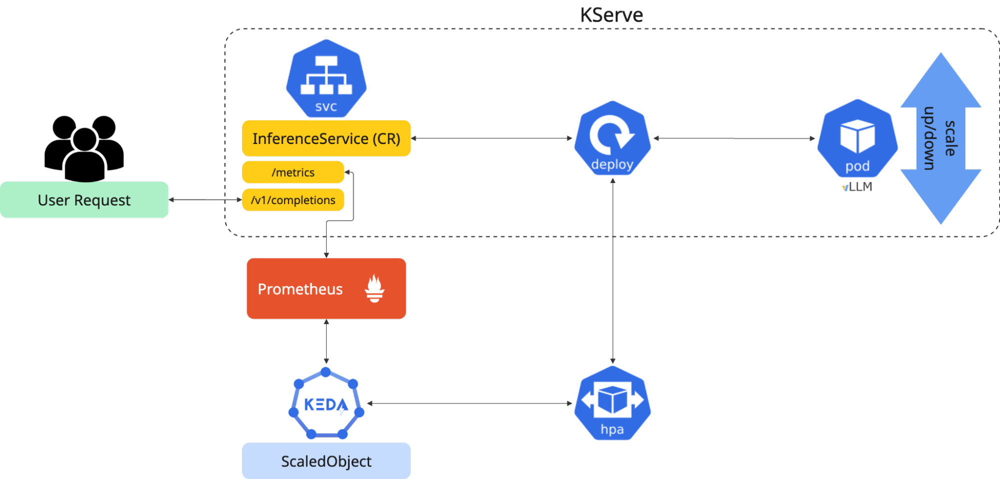
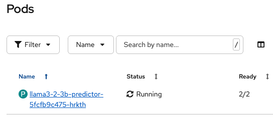
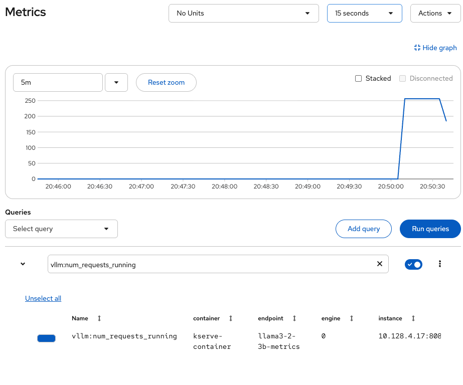
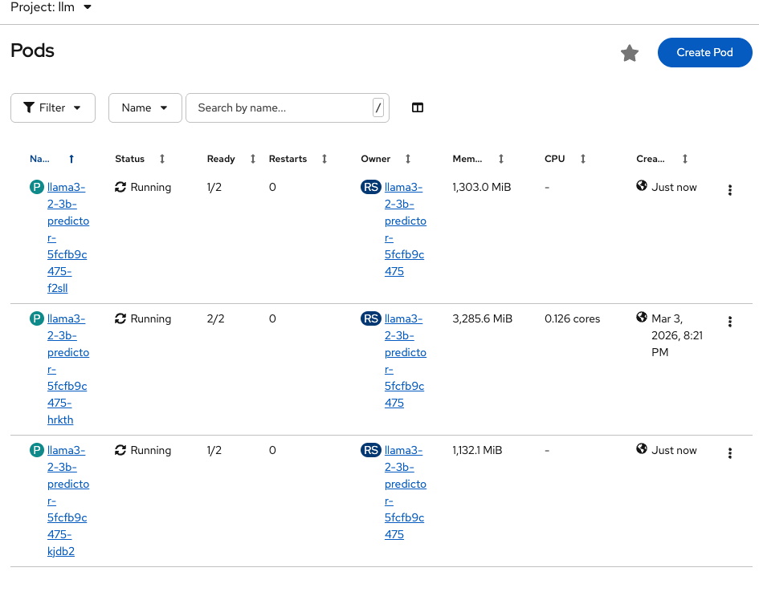

# Dynamic Model Autoscaling with KEDA

Metrics-based autoscaling for LLM inference services on OpenShift AI using KEDA and vLLM metrics. Scale GPU workloads efficiently based on request queue depth.

## Table of Contents

- [Architecture](#architecture)
- [Installation](#installation)
- [Demo](#demo)
  - [Verify Autoscaling Setup](#verify-autoscaling-setup)
  - [Run Load Test](#run-load-test)
  - [Check the Metrics](#check-the-metrics)
  - [Watch Scaling in Action](#watch-scaling-in-action)
- [Scale-to-Zero with KEDA HTTP Add-on](#scale-to-zero-with-keda-http-add-on)

## Architecture



Knative autoscaling is not available in KServe RawDeployment mode. This project uses **KEDA** (Kubernetes Event-driven Autoscaling) to scale InferenceServices based on vLLM Prometheus metrics:

1. vLLM exposes `num_requests_waiting` and `num_requests_running` metrics
2. Prometheus scrapes metrics via ServiceMonitor → Thanos Querier
3. KEDA scales deployment when queue depth exceeds threshold
4. Scale-up: ~30-60s | Scale-down: ~5 min cooldown

### Automatic KEDA Integration

Setting `serving.kserve.io/autoscalerClass: keda` on your InferenceService triggers **odh-model-controller** to automatically create:

- TriggerAuthentication, ServiceAccount, Role, RoleBinding, Secret
- ScaledObject with Prometheus trigger

No manual KEDA configuration required.

## Installation

> **Reference**: This guide is based on the official Red Hat documentation for [Configuring metrics-based autoscaling](https://docs.redhat.com/en/documentation/red_hat_openshift_ai_self-managed/2.19/html/serving_models/serving-large-models_serving-large-models#configuring-metrics-based-autoscaling_serving-large-models)

### Step 0: Prerequisites

- OpenShift AI cluster with GPU nodes (3.0+)
- Cluster admin access

### Step 1: Install KEDA Operator

```bash
oc create namespace openshift-keda
oc label namespace openshift-keda openshift.io/cluster-monitoring=true
helm install keda-operator helm/keda-operator/ -n openshift-keda
```

### Step 2: Enable User Workload Monitoring

```bash
helm install uwm helm/uwm/ -n openshift-monitoring
```

### Step 3: Configure KEDA Controller

```bash
helm install keda helm/keda/ -n openshift-keda
```

### Step 4: Deploy Model (choose one)

#### Option A: Llama 3.2-3

```bash
export NAMESPACE=autoscaling-keda
oc new-project $NAMESPACE
helm install llama3-2-3b helm/llama3.2-3b/ \
  --set keda.enabled=true \
  --set inferenceService.maxReplicas=2 \
  -n $NAMESPACE
```

#### Option B: Granite 3.3-8B

```bash
export NAMESPACE=autoscaling-keda
oc new-project $NAMESPACE
helm install granite3-3-8b helm/granite3.3-8b/ \
  --set keda.enabled=true \
  --set inferenceService.maxReplicas=2 \
  -n $NAMESPACE
```

## Demo

### Verify Autoscaling Setup

```bash
# Check all KEDA resources
oc get scaledobject,hpa,pods -n $NAMESPACE

# Check InferenceService status
oc get inferenceservice -n $NAMESPACE
```



### Run Load Test

Generate load to trigger autoscaling:

```bash
DURATION=60 RATE=20 NAMESPACE=$NAMESPACE ./scripts/basic-load-test.sh
```

```text
+------------------------------------------------------------------------------+
|  KEDA Autoscaling Load Test - vLLM Metrics Monitor                           |
+==============================================================================+
|  Endpoint:    https://llama3-2-3b-autoscaling-keda.apps.XXXX/v1              |
|  Model:       llama3-2-3b                                                    |
|  Namespace:   autoscaling-keda                                               |
|  Deployment:  llama3-2-3b-predictor                                          |
|  Duration:    60s @ 20 req/s                                                 |
|  Max Tokens:  500 (longer = more load)                                       |
+------------------------------------------------------------------------------+

Initial State:
  Metrics: Running=0.0, Waiting=0.0, Success=582
  Pods: 1
  Autoscaler: keda-hpa-llama3-2-3b-predictor   Deployment/llama3-2-3b-predictor   0/2 (avg)   1     3     1     28m

Starting sustained load test...

+----------+------------+------------+------------+----------+--------------------+
| Time     | Running    | Waiting    | Success    | Pods     | Requests Sent      |
+----------+------------+------------+------------+----------+--------------------+
|       0s |       40.0 |        0.0 |        582 |        1 |                  0 |
|       8s |      180.0 |        0.0 |        582 |        1 |                160 |
|      15s |      256.0 |       24.0 |        642 |        1 |                300 |
|      23s |      256.0 |      104.0 |        702 |        1 |                460 |
|      31s |      247.0 |      153.0 |        822 |        1 |                620 |
|      39s |      256.0 |      108.0 |        918 |        3 |                780 |
|      47s |      256.0 |       28.0 |        998 |        3 |                940 |
|      55s |      164.0 |        0.0 |       1106 |        3 |               1100 |
|      63s |        0.0 |        0.0 |       1230 |        3 |               1260 |
+----------+------------+------------+------------+----------+--------------------+
```

### Check the Metrics

Query vLLM metrics in the OpenShift Console (Observe → Metrics):

```promql
# Requests waiting in queue (triggers scale-up when > threshold)
sum(vllm:num_requests_waiting{model_name="llama3-2-3b"})

# Active requests being processed
sum(vllm:num_requests_running{model_name="llama3-2-3b"})
```



### Watch Scaling in Action

```bash
# Watch pod scaling in real-time
oc get pods -n $NAMESPACE -w
```



Scaled from 1 → 3 pods based on `vllm:num_requests_waiting` exceeding the threshold (default: 2).

Expected behavior:

- **Scale-up**: Pods increase from 1 to 3 within ~30-60 seconds when request queue grows
- **Scale-down**: Pods return to 1 after ~5 minutes cooldown when load stops

## Scale-to-Zero with KEDA HTTP Add-on

For cost savings, you may want to scale the model to zero. This requires another element.

### Why Prometheus-based KEDA Cannot Scale to Zero

Prometheus-based KEDA autoscaling works well for 1→N scaling, but **cannot scale to zero** because:

1. **No metrics at zero replicas**: When pods = 0, no vLLM instance is running to generate Prometheus metrics
2. **No endpoints for traffic**: The Route/Service points to a backend with no endpoints, returning 503 errors
3. **KEDA can't detect load**: Without metrics, KEDA never sees incoming traffic and never triggers scale-up

```text
Request → Route → Service (no endpoints) → 503 Error ❌
```

This creates a chicken-and-egg problem: KEDA needs metrics to scale up, but metrics only exist when pods are running.

### Solution, the KEDA HTTP Add-on

The KEDA HTTP Add-on allows us to enable scale-to-zero. This keeps the model at 0 replicas when idle and scales up on first request.

> **See the full demo guide**: [Demo: Scale-to-Zero with KEDA HTTP Add-on](assets/docs/demo-http-addon.md)
>
> **Architecture details**: [KEDA HTTP Add-on Architecture](assets/docs/autoscaling-keda-http-addon.md)

### Quick Start

```bash
export NAMESPACE=autoscaling-keda-http-addon
oc new-project $NAMESPACE

# Install HTTP Add-on with extended timeouts for LLM cold starts
helm repo add kedacore https://kedacore.github.io/charts
helm repo update
helm install http-add-on kedacore/keda-add-ons-http -n openshift-keda \
  --set interceptor.replicas.waitTimeout=180s \
  --set interceptor.responseHeaderTimeout=180s

# Deploy model with scale-to-zero
RELEASE_NAME=llama3-2-3b
ROUTE_HOST="${RELEASE_NAME}-keda-${NAMESPACE}.$(oc get ingresses.config/cluster -o jsonpath='{.spec.domain}')"

helm install $RELEASE_NAME helm/llama3.2-3b/ \
  --set keda.enabled=true \
  --set httpAddon.enabled=true \
  --set httpAddon.host=$ROUTE_HOST \
  --set httpAddon.minReplicas=0 \
  --set httpAddon.maxReplicas=1 \
  --set httpAddon.scaledownPeriod=60 \
  -n $NAMESPACE
```

### Verify Scale-to-Zero

```bash
# Check HTTPScaledObject
oc get httpscaledobject -n $NAMESPACE

# After scaledownPeriod (default 60s), pods scale to 0
oc get pods -n $NAMESPACE

# Send a request to trigger scale-up from 0 to 1
curl -sk https://$ROUTE_HOST/v1/models
```

**Note**: First request after scale-to-zero takes 60-90 seconds while the model loads.
