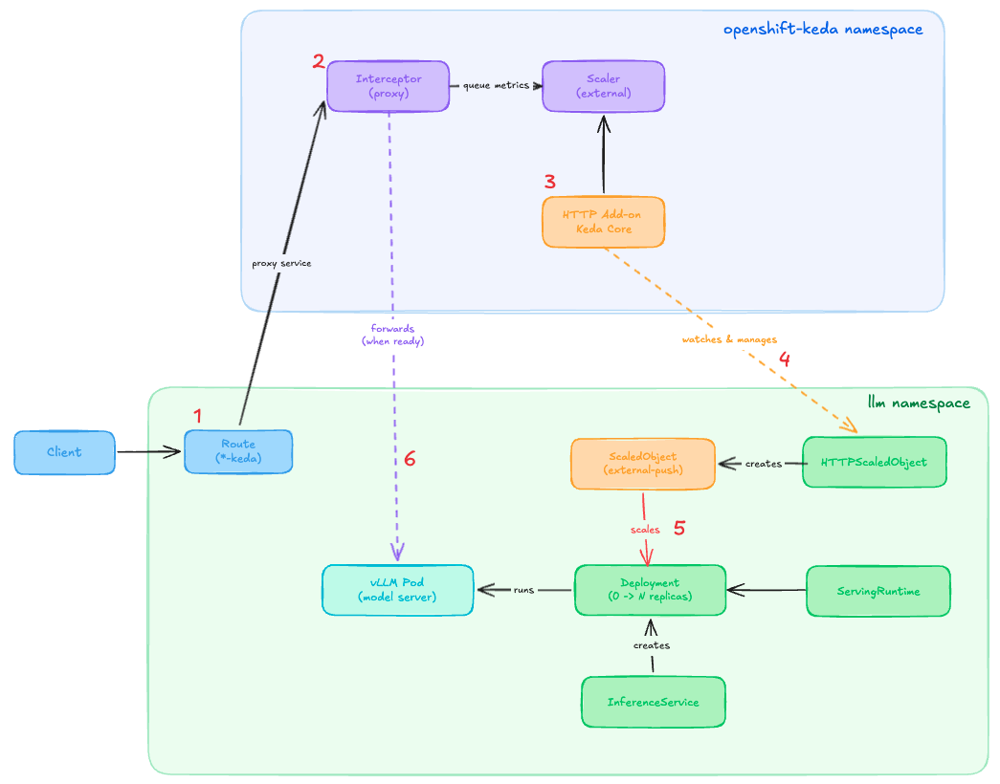
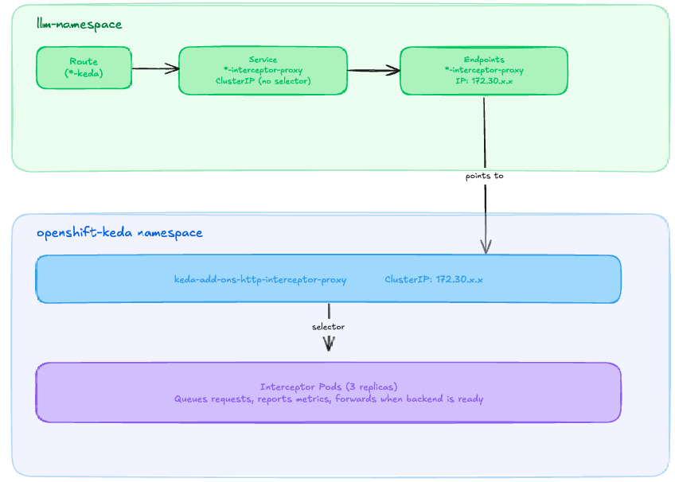
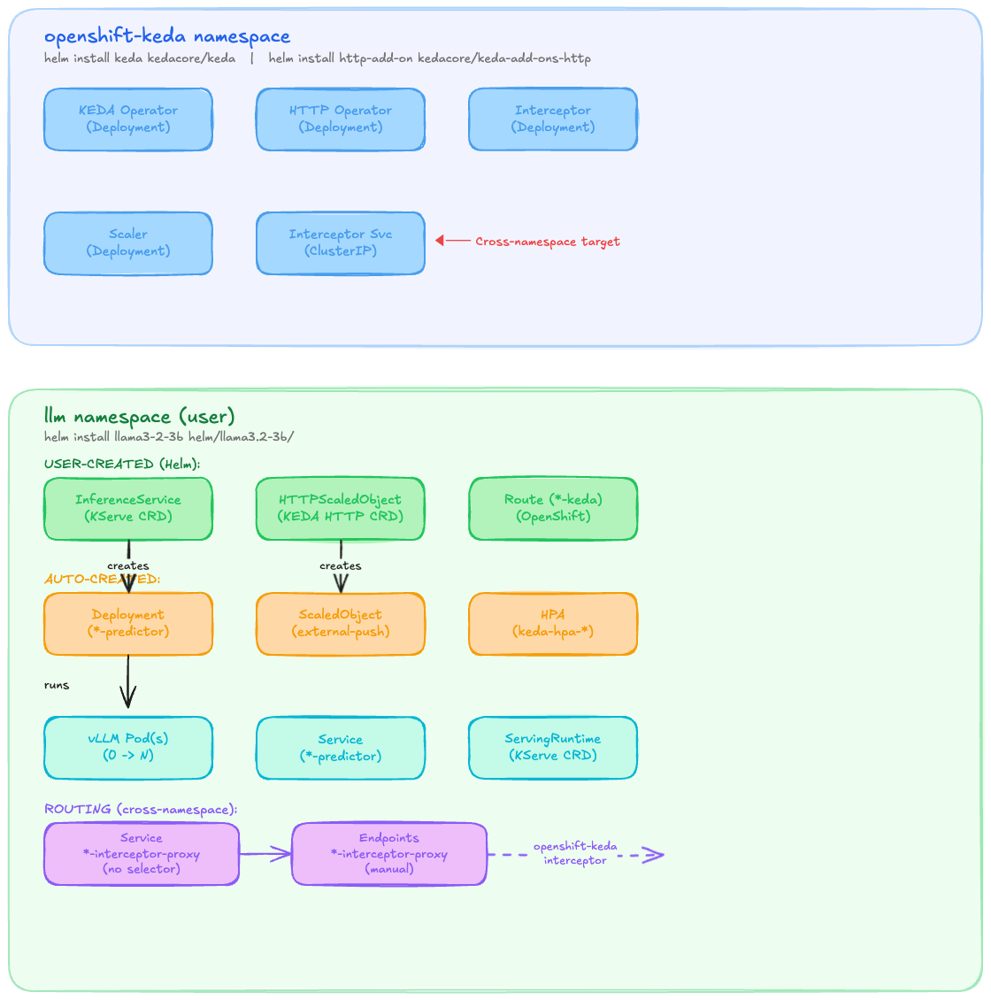

# KEDA HTTP Add-on Autoscaling (0→N)



## Step 1: Client Request Arrives

Request hits the OpenShift Route, which points to the **Interceptor** (not directly to the model).

```yaml
# Route points to interceptor proxy service
spec:
  to:
    kind: Service
    name: llama3-2-3b-interceptor-proxy  # Local proxy → Interceptor
```

## Step 2: Interceptor Queues Request

The Interceptor (always running in `openshift-keda`):
- Holds the request in memory
- Increments queue depth metric
- Reports metrics to the Scaler

## Step 3: KEDA Core Queries the Scaler

**KEDA Core** (`keda-operator`) polls the HTTP Add-on **Scaler** (`keda-add-ons-http-external-scaler`) via gRPC:

```yaml
# ScaledObject trigger (auto-created by HTTP Add-on Operator)
triggers:
  - type: external-push
    metadata:
      scalerAddress: keda-add-ons-http-external-scaler.openshift-keda:9090
```

The Scaler returns queue depth metrics collected from the Interceptor.

> **Note**: The diagram shows "HTTP Add-on KEDA Core" as a single box for simplicity. In reality, these are **two separate components**:
> - **KEDA Core** (`keda-operator`) - Polls the Scaler for metrics and makes scaling decisions
> - **HTTP Add-on Operator** (`keda-add-ons-http-controller-manager`) - Watches HTTPScaledObjects and creates ScaledObjects

## Step 4: Operator Creates ScaledObject

When HTTPScaledObject is deployed, the Operator creates:
- A KEDA ScaledObject with `external-push` trigger
- Configured min/max replicas and scaling thresholds

```yaml
# HTTPScaledObject (user creates)
apiVersion: http.keda.sh/v1alpha1
kind: HTTPScaledObject
spec:
  hosts: ["llama3-2-3b-llm.apps.cluster.com"]
  scaleTargetRef:
    name: llama3-2-3b-predictor
    kind: Deployment
  replicas:
    min: 0    # Scale to zero!
    max: 3
```

## Step 5: KEDA Scales Deployment 0→1

When queue depth > 0:
1. ScaledObject triggers scale-up
2. Deployment goes from 0 → 1 replicas
3. Pod starts (60-120s for LLM)

## Step 6: Interceptor Forwards Request

Once pod is ready:
1. Interceptor detects healthy endpoint
2. Forwards queued request to vLLM
3. Returns response to client

## Step 7: Scale Down to Zero

After `scaledownPeriod` (default 300s) with no traffic:
1. Queue depth = 0
2. KEDA scales Deployment 1 → 0
3. GPU resources released

## Object Locations



## Key Components Summary

> **Note**: The diagram shows "HTTP Add-on KEDA Core" as a single box for simplicity. In reality, these are **two separate components**:
> - **KEDA Core** (`keda-operator`) - Polls the Scaler for metrics and makes scaling decisions
> - **HTTP Add-on Operator** (`keda-add-ons-http-controller-manager`) - Watches HTTPScaledObjects and creates ScaledObjects

| Component | Namespace | Created By | Purpose |
|-----------|-----------|------------|---------|
| KEDA Core (keda-operator) | openshift-keda | Helm (keda) | Polls Scaler, makes scaling decisions, manages HPA |
| HTTP Operator | openshift-keda | Helm (http-add-on) | Watches HTTPScaledObject, creates ScaledObject |
| Interceptor | openshift-keda | Helm (http-add-on) | Queues requests, reports metrics |
| Scaler | openshift-keda | Helm (http-add-on) | Aggregates metrics for KEDA |
| InferenceService | llm | Helm (model chart) | KServe model definition |
| ServingRuntime | llm | Helm (model chart) | vLLM runtime config |
| HTTPScaledObject | llm | Helm (model chart) | Defines HTTP scaling rules |
| Route (*-keda) | llm | Helm (model chart) | External entry point |
| Deployment | llm | KServe (auto) | vLLM pods (0→N) |
| ScaledObject | llm | HTTP Operator (auto) | KEDA external-push trigger |
| HPA | llm | KEDA (auto) | Kubernetes autoscaler |
| Service (*-interceptor-proxy) | llm | Helm (model chart) | Cross-namespace routing |
| Endpoints (*-interceptor-proxy) | llm | Helm (model chart) | Points to interceptor |

## Why This Works (vs Prometheus-based)

| Prometheus KEDA | HTTP Add-on |
|-----------------|-------------|
| Metrics from vLLM | Metrics from Interceptor |
| No pods = no metrics | Interceptor always running |
| Can't detect traffic at 0 | Queue depth visible at 0 |
| **1→N scaling only** | **0→N scaling** |

## Critical Configuration

### HTTP Add-on Installation (for LLM cold starts)
```bash
helm upgrade http-add-on kedacore/keda-add-ons-http -n openshift-keda \
  --set interceptor.replicas.waitTimeout=180s \
  --set interceptor.responseHeaderTimeout=180s
```

### Route Naming (RHOAI Compatibility)

Route must NOT match InferenceService name to avoid deletion by `odh-model-controller`:

```yaml
name: {{ .Release.Name }}-keda  # Not {{ .Release.Name }}
```

**Why?** The `odh-model-controller` watches for routes matching the InferenceService name. If `networking.kserve.io/visibility` isn't set to `exposed`, it deletes the route. Using a `-keda` suffix prevents this.

### HAProxy Timeout (for cold starts)

Add annotation to Route for LLM cold start times:

```yaml
annotations:
  haproxy.router.openshift.io/timeout: 180s
```

## Cross-Namespace Routing Pattern

OpenShift Routes require endpoints to exist, but the Interceptor runs in `openshift-keda` while our Route is in `llm`. ExternalName services don't work with Routes, so we use a **ClusterIP + manual Endpoints** pattern:



**How it works:**

1. **Route** → points to local Service `*-interceptor-proxy`
2. **Service** (no selector) → uses manually-defined Endpoints
3. **Endpoints** → contains ClusterIP of Interceptor in `openshift-keda`
4. **Interceptor** → queues requests, triggers scaling, forwards when ready

**Helm auto-detection (in route.yaml):**

```yaml
{{- $interceptorSvc := lookup "v1" "Service" $kedaNamespace "keda-add-ons-http-interceptor-proxy" }}
{{- $interceptorIP := "" }}
{{- if $interceptorSvc }}
  {{- $interceptorIP = $interceptorSvc.spec.clusterIP }}        # Auto-detected from cluster
{{- else if .Values.httpAddon.interceptorIP }}
  {{- $interceptorIP = .Values.httpAddon.interceptorIP }}       # Fallback for GitOps
{{- else }}
  {{- fail "KEDA HTTP Add-on interceptor not found..." }}       # Helpful error
{{- end }}
```

**Get interceptor IP manually:**
```bash
oc get svc keda-add-ons-http-interceptor-proxy -n openshift-keda -o jsonpath='{.spec.clusterIP}'
```